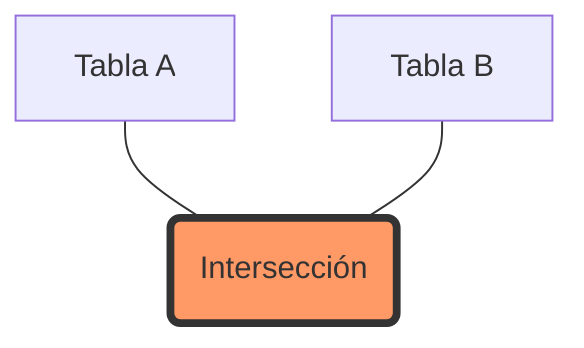
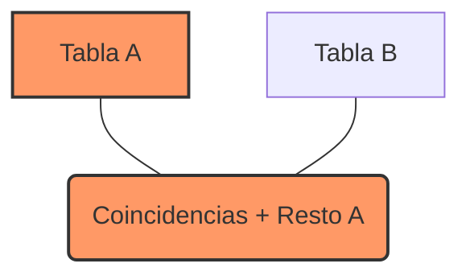

# SQL Joins: Guía Completa

Los **JOINS** en SQL se utilizan para combinar filas de dos o más tablas, basándose en una columna relacionada entre ellas. Son fundamentales para trabajar con bases de datos relacionales donde la información está normalizada y distribuida en múltiples tablas.

---

## 📊 Conceptos Básicos
Imaginemos dos tablas para nuestros ejemplos:

### Tabla `Usuarios`
| id | nombre | pais_id |
|----|--------|---------|
| 1  | Ana    | 1       |
| 2  | Luis   | 2       |
| 3  | Maria  | NULL    |

### Tabla `Paises`
| id | nombre_pais |
|----|-------------|
| 1  | España      |
| 2  | México      |
| 3  | Argentina   |

---

## 1. INNER JOIN
Devuelve registros que tienen valores coincidentes en ambas tablas. Es el tipo de join más común.



**Ejemplo:** Obtener usuarios y sus países (solo si tienen país asignado).
```sql
SELECT Usuarios.nombre, Paises.nombre_pais
FROM Usuarios
INNER JOIN Paises ON Usuarios.pais_id = Paises.id;
```
*Resultado: Ana (España), Luis (México).*

---

## 2. LEFT (OUTER) JOIN
Devuelve todos los registros de la tabla de la izquierda (Tabla A) y los registros coincidentes de la tabla de la derecha (Tabla B). Si no hay coincidencia, devuelve `NULL` para la tabla de la derecha.



**Ejemplo:** Obtener todos los usuarios, tengan o no un país asignado.
```sql
SELECT Usuarios.nombre, Paises.nombre_pais
FROM Usuarios
LEFT JOIN Paises ON Usuarios.pais_id = Paises.id;
```
*Resultado: Ana (España), Luis (México), Maria (NULL).*

---

## 3. RIGHT (OUTER) JOIN
Devuelve todos los registros de la tabla de la derecha (Tabla B) y los registros coincidentes de la tabla de la izquierda (Tabla A). Si no hay coincidencia, devuelve `NULL` para la tabla de la izquierda.

**Ejemplo:** Obtener todos los países, tengan o no usuarios asociados.
```sql
SELECT Usuarios.nombre, Paises.nombre_pais
FROM Usuarios
RIGHT JOIN Paises ON Usuarios.pais_id = Paises.id;
```
*Resultado: Ana (España), Luis (México), NULL (Argentina).*

---

## 4. FULL (OUTER) JOIN
Devuelve todos los registros cuando hay una coincidencia en una de las tablas. Si no hay coincidencia, devuelve `NULL` en el lado que falte. Combina el efecto de `LEFT JOIN` y `RIGHT JOIN`.

**Ejemplo:** Obtener todos los usuarios y todos los países.
```sql
SELECT Usuarios.nombre, Paises.nombre_pais
FROM Usuarios
FULL OUTER JOIN Paises ON Usuarios.pais_id = Paises.id;
```

---

## 5. CROSS JOIN
Produce el producto cartesiano de las dos tablas, es decir, combina cada fila de la primera tabla con cada fila de la segunda. No requiere una condición `ON`.

**Ejemplo:**
```sql
SELECT Usuarios.nombre, Paises.nombre_pais
FROM Usuarios
CROSS JOIN Paises;
```
*Si hay 3 usuarios y 3 países, el resultado tendrá 9 filas.*

---

## 6. SELF JOIN
Es un join normal, pero la tabla se une consigo misma. Es útil para consultar datos jerárquicos (ej. empleados y sus jefes en la misma tabla).

**Ejemplo:**
```sql
SELECT A.nombre AS Empleado, B.nombre AS Jefe
FROM Empleados A
INNER JOIN Empleados B ON A.jefe_id = B.id;
```

---

## 💡 Resumen Rápido

| Tipo de Join | Descripción |
|--------------|-------------|
| **INNER**    | Solo coincidencias exactas. |
| **LEFT**     | Todo lo de la izquierda + coincidencias. |
| **RIGHT**    | Todo lo de la derecha + coincidencias. |
| **FULL**     | Absolutamente todo de ambas tablas. |
| **CROSS**    | Producto cartesiano (todas las combinaciones). |

> [!TIP]
> Para optimizar los JOINS, asegúrate de que las columnas utilizadas en la condición `ON` (generalmente llaves foráneas y primarias) estén debidamente **indexadas**.
